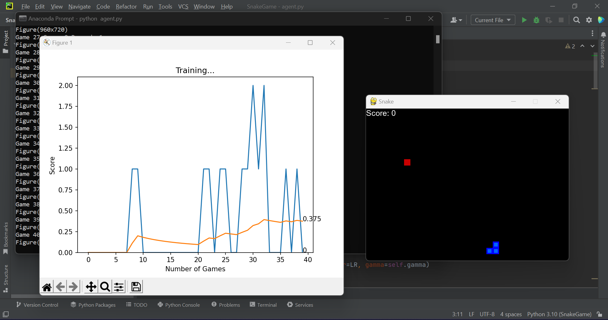

# Serpendroid

## Overview

This project is an implementation of the classic Snake game using Python and the Pygame library. In addition to the traditional human-player version of the game, this project also includes an AI-driven version where an agent learns to play the game through reinforcement learning.

## Project Structure

### Files

- **Agent.py**: Contains the implementation of an agent for reinforcement learning. The agent interacts with the environment (game) and learns to make decisions to maximize its rewards.
- **Game.py**: Provides the core logic for the Snake game. It includes classes to represent the game state, handle user input, update the game state, and manage the rendering of the game.
- **Helper.py**: Offers helper functions, including a plotting function for visualizing scores during training.
- **Model.py**: Defines the neural network model used by the agent for decision-making in the reinforcement learning version of the game.
- **Snake_Game_Human.py**: Implements the human-player version of the Snake game, allowing users to control the snake using keyboard inputs.
- **requirements.txt**: Lists the dependencies required to run the project.
- **Screenshots/**: Directory containing screenshots of the game in action.

### Dependencies

- **Pygame**: A cross-platform set of Python modules designed for writing video games.
- **Matplotlib**: A plotting library for Python.
- **PyTorch**: A deep learning framework for building and training neural networks.
- **NumPy**: A library for numerical computing with support for arrays, matrices, and mathematical functions.
- **Enum34**: An enumeration package backported from Python 3.4 for use in Python 2.7.
- **FontTools**: A library for manipulating font files, possibly used for font rendering in Pygame.
- **pygame-menu**: A library for creating menus in Pygame-based applications, if menu functionality is present in the game.

## How to Run 

To run the Snake Game, ensure that you have Python installed on your system along with the 
required dependencies listed in `requirements.txt`.

### Human-Player Version :

To play the human-player version, execute the following command:

```python Snake_Game_Human.py```


### Reinforcement Learning Version :

To train and run the reinforcement learning version, execute the following command:

```python Agent.py```


## Gameplay

### Human-Player Version

- Use the arrow keys (up, down, left, right) to control the direction of the snake.
- The snake grows longer by eating food that appears randomly on the screen.
- Avoid colliding with the walls of the game area or with the snake's own body.
- The game ends when the snake collides with a wall or with itself.
- Try to achieve the highest score possible by eating as much food as you can before the game ends.

### Reinforcement Learning Version

- The AI agent learns to play the game through reinforcement learning.
- The agent interacts with the environment, observes states, takes actions, and receives rewards.
- Over time, the agent learns to make decisions that maximize its cumulative rewards, leading to better performance in the game.

## Screenshots





